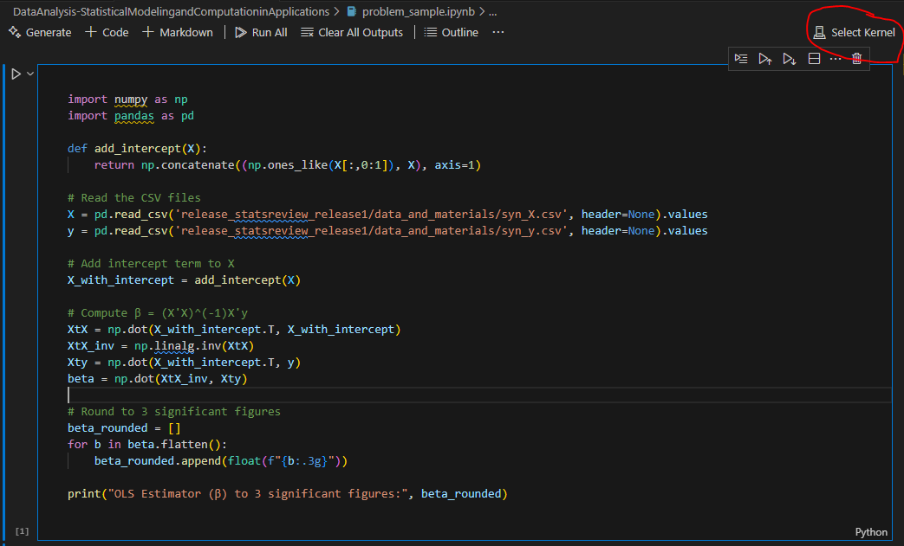

# python_lab
Python lab for Data Science learning

## Prerequisites

Github account: To clone the repo.
IDE: Visual Studio Code (https://code.visualstudio.com/)
Containerization: Docker Desktop (https://www.docker.com/products/docker-desktop/)
Source control: Git (https://git-scm.com/)

> Install the VS Code extension, https://code.visualstudio.com/docs/devcontainers/create-dev-container

## By default this dev environment comes with
Python 3.12
Installed packages
- scipy==1.15.1
- numpy==2.2.2
- matplotlib==3.10.0
- scikit-learn
- statsmodels==0.14.4
- ipykernel==6.29.5

Additional packages can be installed by adding them to the `requirements.txt` file.

Installed Extensions
- ms-python.python
- ms-python.debugpy
- ms-python.vscode-pylance
- github.copilot
- zainchen.json
- streetsidesoftware.code-spell-checker
- bierner.markdown-mermaid
- vstirbu.vscode-mermaid-preview
- mechatroner.rainbow-csv
- ms-toolsai.jupyter

Additional VS Code extensions can be installed by adding them to the `.devcontainer/devcontainer.json` file.

> Make sure to either Rebuild Container command when you add new packages or extensions to above files.

## To run Python code

I have a sample notebook `problem_1_2.ipynb`  under the folder `DataAnalysis-StatisticalModelingandComputationinApplications`

Feel free to clone fork as per requirement. 

> Some time the notebook fails to select the kernel. Check Extensions to ensure the `ms-toolsai.jupyter` installed, instal;l if not. 

> If you are new to Notebooks or need  refreshes then refer, https://marketplace.visualstudio.com/items?itemName=ms-toolsai.jupyter

> Ensure you select proper kernel. Default is Python 3.12.8 or greater

